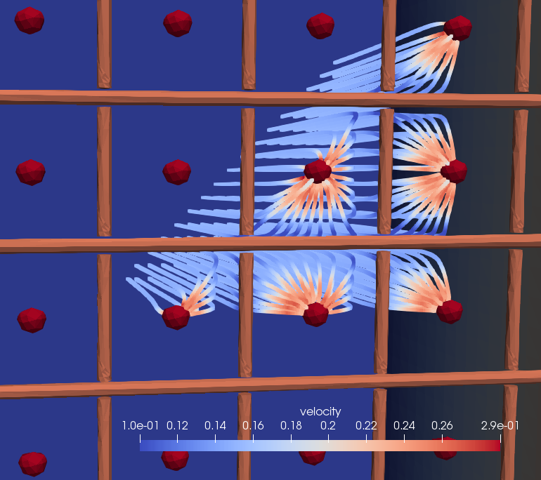

# Integrating drift simulation into pixsim 
Currently, *pixsim* does not offer a drift simulation. Instead, a tool like [pixgen](https://github.com/hcsullivan/pixgen) can be used to derive the charge distribution near a readout plane taking into account attenuation and diffusion effects. [pixgen](https://github.com/hcsullivan/pixgen) is a modified version of [larsim](https://cdcvs.fnal.gov/redmine/projects/larsim) that uses [Geant4](https://geant4.web.cern.ch/) to simulate various particles inside a liquid argon time projection chamber. One of the standard routines is an ionization charge drift simulation. 

Note: the *python/pixsim/driftsim.py* is a concrete example of integrating drift simulation from [pixgen](https://github.com/hcsullivan/pixgen) into *pixsim*. The items that are needed for *pixsim* are the (x,y,z) coordinates of the drifted charge and the pixel coordinates. For the remainder of this section, it is assumed that a [ROOT](https://root.cern.ch/) ntuple contains this information. Any additions or modifications made to this ntuple may need to be addressed in the *python/pixsim/driftsim.py* file.

# Example 
This section will walk through a simulation integrating results from [pixgen](https://github.com/hcsullivan/pixgen). Let's use the alias `pix` defined as
```
$ alias pix='pixsim -c boxtpc.cfg -s test.db -m tpcgeometry.msh'
```
Note: For any command, you can add the `--help` flag to view the options for the command's options. 

## Initial steps
Generate the geometry
```
$ pix gen geo -c <geometry_section_name> -o <name_of_geo_file>
```
Generate the domain map
```
$ pix gen dmap
```
Run BEM++
```
$ pix boundary
```
Evaluate
```
$ pix raster
```
Compute velocity
```
$ pix velocity
```
Instead of averaging responses across different pixels, we can derive the response for a single pixel. We select the center pixel as the pixel of interest which, in our case, has a domain ID of 50.  

Setting `domain=50` in the configuration file under the section `weighting`, calculate the weighting field for pixel domain ID 50
```
$ pix boundary -c weighting
```

## Generating the steps
We now have the velocity field and the weighting field. The next step is to derive the paths that unit charges would take near the pixel plane. To do this *pixsim* requires knowing the initial points to step from--the vertices.

One way of proceeding is to parameterize the response based on the proximity to the pixel. Then for a given electron cloud, we can lookup the "nearest response." Consequently, there is a tradeoff between the granularity of the parameterization and simulation time/space. 

Luckily, due to symmetry, we only need to generate vertices in a 45 degree arc (half of the first quadrant) centered on the pixel. *pixsim* provides a tool to do this.
```
$ pix gen vtx -s step_lookup.txt
```
*step_lookup.txt* is a template file used to generate vertices. One has been provided here *drift_sim/with_grid/step_lookup.txt*. The file follows the convention
```
domains <id1> <id2> ... <idn>
vx1 vy1 vz1
vx2 vy2 vz2
.
.
.
```
This will generate vertices for domains *[1,2...,n]*, where the vertices are specified relative to the pixel center. Example,
```
domains 50 60
1 0 0
1 0 1
```
will generate two vertices for domain 50 and domain 60. Two vertices will be centered on each pixel, and the other two vertices will be shifted *1cm* in the z direction. All four vertices are located *1cm* away from the pixel plane. 

This will generate a folder of text files to use in the stepping algorithm. The provided *step_lookup.txt* file will generate vertices only for domain=50.

Run the stepping algorithm for these vertices
```
$ pix gen step 
```
The result is shown below



Calculate induced current
```
$ pix gen current 
```
Convolve field response with electronics response
```
$ pix gen response -w <current_result_id> -s <step_result_id>
```
After listing the path to the *pixgen* ntuple in the configuration file, run the simulation
```
$ pix sim
```
This command will do the following:

1. For each charge cloud, find nearest response based on promixity to nearest pixel.
2. When a pixel collects its first charge cloud, a waveform is made from the nearest response.
3. As a pixel collects more charge clouds, the nearest response is added to the waveforms saved previously, resulting in a superposition of responses centered on the times of arrival.
4. Final waveforms are saved in the database.

## Analysis
The entry point for analyzing these waveforms is through the command
```
pix ana
```
This runs the *analyze* method in the file *python/pixsim/analyze.py*. Note, this is an analysis script, so modifications are expected. This may be slow, based on how many events were simulated in the previous step. 